# Tribble

**Humanitarian intelligence platform.** Multi-source crisis data flows through a deterministic LangGraph pipeline, is scored across nine confidence signals, clustered spatiotemporally, and served as GeoJSON to maps and dashboards.

---

## Table of contents

- [What it does](#what-it-does)
- [System architecture](#system-architecture)
- [Codebase architecture](#codebase-architecture)
- [Integrations](#integrations-at-a-glance)
- [Repository layout](#repository-layout)
- [Prerequisites & getting started](#prerequisites)
- [Testing & documentation](#testing)

---

## What it does

Tribble ingests crisis-related reports from multiple sources (ACLED, news, **satellite**, **weather**, community submissions, **Discord**, **WhatsApp**), runs them through a fixed pipeline, and surfaces structured intelligence:

- **Unified pipeline** — One LangGraph state graph. **Z.AI (GLM)** and optional open-source models handle translation, extraction, and classification; everything else is deterministic.
- **Satellite & weather** — Sentinel-2 imagery, NDVI/NDWI, change detection, and weather-at-point validation feed into confidence and event analysis.
- **Confidence scoring** — Each report is scored on nine signals before clustering.
- **Spatiotemporal clustering** — Events are grouped by time and geography into incident clusters.
- **Map-first output** — Clusters and reports are exposed as GeoJSON and consumed by the frontend map and analysis views.
- **Multi-channel deployment** — Submit reports via web form, **Discord** bot, or **WhatsApp** intake; same pipeline and confidence treatment for all channels.

This is a **pipeline**, not an agent swarm: predictable, testable, and auditable. The operator-facing **OpenClaw-style assistant** and optional **FLock** integration provide agentic interfaces on top.

---

## System architecture

End-to-end flow: external inputs → FastAPI (REST + workers) → LangGraph pipeline → Supabase (Postgres + PostGIS) → GeoJSON APIs → Next.js frontend (Mapbox/Maplibre, dashboards).

### High-level diagram

```mermaid
flowchart TB
  subgraph External["External inputs"]
    ACLED[ACLED API]
    Weather[Open-Meteo / OpenWeather]
    STAC[Planetary Computer STAC]
    LLM[Z.ai / Anthropic / Flock]
    Discord[Discord webhook]
    WhatsApp[WhatsApp intake]
    News[News / events]
  end

  subgraph Backend["Tribble Backend (FastAPI)"]
    subgraph API["API layer"]
      reports["/api/reports"]
      clusters["/api/clusters"]
      routes["/api/routes"]
      analysis["/api/analysis"]
      relief["/api/relief"]
      helios["/api/helios"]
      satellite["/api/satellite"]
      pipeline["/api/pipeline"]
      worker["/api/worker"]
      intake["/api/intake"]
      weather["/api/weather"]
    end

    subgraph Pipeline["LangGraph pipeline"]
      direction TB
      prefilter[prefilter]
      normalize[normalize]
      translate[translate]
      verify[verify_extract]
      classify[classify]
      geocode[geocode]
      dedupe[deduplicate]
      corroborate[corroborate]
      fetch_weather[fetch_weather]
      enrich_weather[enrich_weather]
      fetch_sat[fetch_satellite]
      enrich_sat[enrich_satellite]
      score[score]
      cluster[cluster]
    end

    Worker[Pipeline worker]
  end

  subgraph DB["Supabase (Postgres + PostGIS + RLS)"]
    events[(events)]
    reports_t[(reports)]
    jobs[(pipeline_jobs)]
    clusters_t[(incident_clusters)]
    civilian[(civilian_reports)]
    analysis_t[(analysis_results)]
    satellite_t[(satellite_scenes)]
    weather_t[(weather_data)]
  end

  subgraph Frontend["Next.js frontend (tribble/)"]
    Map[Map / Globe]
    Pages[Reports, Relief, Routes, Intelligence, Satellite, etc.]
    DataContext[DataContext / API client]
  end

  ACLED --> API
  Weather --> Pipeline
  STAC --> Pipeline
  LLM --> Pipeline
  Discord --> intake
  WhatsApp --> intake
  News --> API

  reports --> DB
  Worker --> jobs
  Worker --> Pipeline
  Pipeline --> events
  Pipeline --> civilian
  Pipeline --> clusters_t
  Pipeline --> analysis_t
  clusters --> clusters_t
  analysis --> analysis_t

  DB --> API
  API --> DataContext
  DataContext --> Map
  DataContext --> Pages
```



### Layer summary

| Layer | Role |
|-------|------|
| **External inputs** | ACLED, weather APIs, Sentinel-2/STAC, LLM providers (Z.AI, Anthropic, Flock), Discord, WhatsApp, news ingestion. |
| **FastAPI** | Single app; CORS, `/health`, and all API routers mounted in `main.py`. |
| **API layer** | REST endpoints for reports, clusters, routes, relief runs, geolocation, assistant, helios, satellite, weather, pipeline, worker, intake, analysis, realtime, simulation, streaming. |
| **Pipeline** | Fixed LangGraph state graph (~15 nodes): prefilter → normalize → translate → verify_extract → classify → geocode → deduplicate → corroborate → fetch_weather → enrich_weather → fetch_satellite → enrich_satellite → score → cluster. LLMs used only for translation, extraction, classification; rest is deterministic. |
| **Worker** | Consumes `pipeline_jobs` from Supabase (`claim_next_job`), runs graph, persists outputs via `persist_pipeline_outputs`. |
| **Supabase** | Postgres + PostGIS + RLS. Core: `events`, `civilian_reports`, `submissions`, `analysis_results`, `reports`, `locations`, `pipeline_jobs`, `incident_clusters`, `satellite_scenes`, `weather_data`. RPCs for GeoJSON clusters, job claiming, refresh. |
| **Frontend** | Next.js app in `tribble/`. DataContext + `lib/api.ts` call backend; Mapbox/Maplibre map, report submission, relief runs, routes, intelligence, satellite views, alerts, audit, settings. |

---

## Codebase architecture

### Directory structure

```
tribble/
├── backend/                    # Python FastAPI + LangGraph
│   ├── src/tribble/
│   │   ├── main.py             # App entry, CORS, health, router mount
│   │   ├── config.py           # Settings (TRIBBLE_* env)
│   │   ├── db.py               # Supabase client
│   │   ├── api/                # One router per domain (reports, clusters, relief, …)
│   │   ├── pipeline/           # state.py, graph.py (LangGraph nodes + build_pipeline)
│   │   ├── services/           # worker, persistence, satellite_fusion, LLM providers, …
│   │   ├── ingest/             # ACLED, satellite, weather, seed_supabase
│   │   ├── geolocation/        # Place extraction, resolution, GeoJSON
│   │   └── models/             # Pydantic models (report, confidence, cluster, …)
│   └── tests/
├── tribble/                    # Next.js frontend
│   ├── app/                    # App router: /app/map, /app/submit, /app/relief, …
│   ├── components/             # Map, layout, shared UI
│   ├── lib/                    # api.ts (backend client), types, placeholders
│   ├── store/                 # Redux/Zustand slices (UI, reports, realtime)
│   └── context/               # DataContext (clusters, reports, API wiring)
├── supabase/
│   └── migrations/            # PostGIS, schema, RPCs (events, clusters, relief, …)
├── docs/                      # Architecture, plans, runbooks, MCP
└── .agents/skills/            # Agent skills (TDD, plans, debugging)
```

### Data flow (simplified)

1. **Ingestion** — Reports enter via `/api/reports`, `/api/intake/discord`, `/api/intake/whatsapp`, or ingest scripts (ACLED, CSV). Stored as submissions/reports and enqueued as `pipeline_jobs`.
2. **Processing** — Worker claims a job, builds pipeline state from report, runs LangGraph from START to END. Nodes call external services (LLM, weather, STAC) and update state; final node persists to `events`, `civilian_reports`, `incident_clusters`, `analysis_results`.
3. **Serving** — Frontend calls `/api/clusters`, `/api/geolocation`, etc. Backend reads from Supabase (and optional RPCs like `get_incident_clusters_geojson`), returns GeoJSON or JSON.
4. **Map & UI** — DataContext fetches clusters/reports; map and panels consume them. Submit and relief forms POST to API; errors and success are shown via toasts.

### Key files

| Area | File(s) |
|------|--------|
| Backend entry | `backend/src/tribble/main.py` |
| Pipeline graph | `backend/src/tribble/pipeline/graph.py`, `state.py` |
| Pipeline worker | `backend/src/tribble/services/worker.py`, `persistence.py` |
| API routes | `backend/src/tribble/api/*.py` (reports, clusters, relief, routes, analysis, satellite, …) |
| Frontend API client | `tribble/lib/api.ts` |
| Map & data | `tribble/context/DataContext`, `tribble/components/map/*` |
| Database schema | `supabase/migrations/*`, `docs/tribble-schema.sql` |

---

## Integrations at a glance

| Area | What’s integrated |
|------|--------------------|
| **Satellite** | Sentinel-2 (STAC/Planetary Computer), NDVI/NDWI, change detection, event–satellite fusion, ML-based image quality (SCL) |
| **Weather** | At-point weather and risk (flood, storm, heat, route disruption) for report validation |
| **News / events** | ACLED historical, news-feed events, geolocation pipeline |
| **LLM / agents** | Z.AI (GLM series) for translation, extraction, classification; OpenClaw-style operator assistant; optional FLock API for open-source inference |
| **Multi-channel intake** | Discord (bot + `POST /api/intake/discord`), WhatsApp (`POST /api/intake/whatsapp`); same pipeline for all sources |
| **Data & infra** | Supabase (Postgres + PostGIS), LangGraph pipeline, GeoJSON APIs, Mapbox/Maplibre frontend |

---

## Repository layout

| Path | Purpose |
|------|--------|
| `backend/` | FastAPI app, LangGraph pipeline, ingest, geolocation, API routes |
| `tribble/` | Next.js app (map, reports, intelligence, satellite views) |
| `supabase/` | Migrations, config |
| `docs/` | Architecture, plans, runbooks, MCP/Supabase notes |
| `.agents/skills/` | Agent skills (TDD, plans, debugging, etc.) |

---

## Prerequisites

- **Python 3.12+** (backend). Recommend [uv](https://docs.astral.sh/uv/) for installs and running.
- **Node 20+** (frontend in `tribble/`).
- **Supabase** project (Postgres + PostGIS). Use the Supabase dashboard or CLI for migrations.

---

## Getting started

### Backend

```bash
cd backend
cp .env.example .env   # then set TRIBBLE_SUPABASE_URL, TRIBBLE_SUPABASE_SERVICE_KEY, etc.
uv sync
uv run uvicorn tribble.main:app --reload --port 8000
```

- Health: [http://localhost:8000/health](http://localhost:8000/health)
- OpenAPI: [http://localhost:8000/docs](http://localhost:8000/docs)

Run from `backend/` so `tribble` resolves as the top-level package.

### Frontend

```bash
cd tribble
cp .env.local.example .env.local   # set NEXT_PUBLIC_SUPABASE_URL, NEXT_PUBLIC_SUPABASE_ANON_KEY, NEXT_PUBLIC_API_URL
npm install
npm run dev
```

App runs on the port Next.js reports (typically 3000).

### Database

Apply migrations with the Supabase CLI (or dashboard) against your project. Migrations are in `supabase/migrations/` (PostGIS, schema, RPCs, etc.).

---

## Testing

- **Backend:** `cd backend && uv run pytest`
- **Frontend:** from `tribble/`, use the project’s test runner (e.g. Vitest/Jest if configured).

Development workflow is TDD: write failing tests first, then implementation. See `AGENTS.md` for conventions and plan references.

---

## Documentation

| Doc | Description |
|-----|-------------|
| [AGENTS.md](AGENTS.md) | Project overview, stack, workflow, skills, coding conventions |
| [docs/backend-summary-and-architecture.md](docs/backend-summary-and-architecture.md) | System map, API layer, pipeline, Supabase |
| [docs/plans/](docs/plans/) | Implementation plans (humanitarian platform, stage 2, satellite, etc.) |
| [docs/mcp-supabase.md](docs/mcp-supabase.md) | Supabase MCP setup (when applicable) |

---

## Hackathon / track alignment

Tribble is built to align with:

- **FLock Track (SDG-focused agentic AI)** — OpenClaw-style assistant, multi-channel deployment (WhatsApp, Discord), optional FLock API and open-source model inference, measurable impact via crisis clustering and confidence scoring.
- **Z.AI bounty** — Z.AI (GLM series) integrated for translation, extraction, classification, and orchestration within the pipeline; working prototype with live demo path.
- **TCC AI Agent / satellite** — Real-world event detection, Sentinel-2 retrieval and analysis (NDVI, NDWI, change detection, flood example), weather and news fusion, and insights delivered via map and API.

---

## Contributing

- **Commits:** Small, atomic, one logical change per commit.
- **Features:** Align with the implementation plans in `docs/plans/`; avoid scope creep (YAGNI).
- **Git worktrees:** Isolated feature work can use `.worktrees/`; see the using-git-worktrees skill if you use agent workflows.

---

## License

See repository license file if present.
