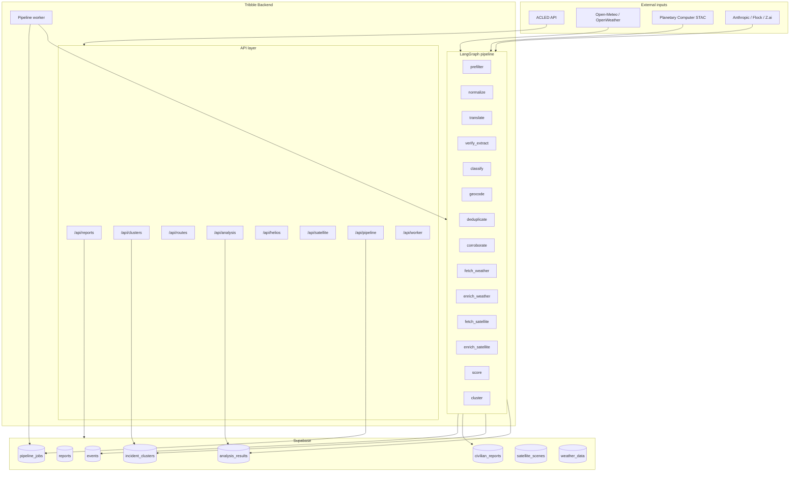

# Tribble Backend — Summary & System Architecture

**Purpose:** Shareable backend overview and system architecture map for onboarding. Tribble is a **humanitarian intelligence platform**: multi-source crisis data flows through a deterministic LangGraph pipeline, gets scored (9 confidence signals), clusters spatiotemporally, and serves GeoJSON + analysis to a map and dashboards.

---

## 1. High-level summary

- **Stack:** Python 3.12+, FastAPI, LangGraph, Pydantic, Supabase (Postgres + PostGIS + RLS).
- **Design:** **Pipeline, not agent swarm.** A fixed LangGraph state graph (15 nodes) processes reports; LLMs handle translation, extraction, classification; everything else is deterministic.
- **Data flow:** Submissions → pipeline jobs → LangGraph (prefilter → … → cluster) → persistence to Supabase (events, civilian_reports, incident_clusters, analysis_results). APIs read from Supabase and optional external APIs (ACLED, weather, satellite, LLMs).
- **Key surfaces:** REST API (reports, clusters, routes, analysis, satellite, helios chat, worker, pipeline, etc.), pipeline queue consumed by workers, streaming/simulation for load testing.

---

## 2. System architecture map

```
┌─────────────────────────────────────────────────────────────────────────────────┐
│                              EXTERNAL INPUTS                                      │
├─────────────────────────────────────────────────────────────────────────────────┤
│  ACLED API │ OpenWeather/Open-Meteo │ Microsoft Planetary Computer (STAC)       │
│  Anthropic │ Flock │ Z.ai │ Discord webhook │ News/events ingestion              │
└─────────────────────────────────────────────────────────────────────────────────┘
                                        │
                                        ▼
┌─────────────────────────────────────────────────────────────────────────────────┐
│                              FASTAPI APPLICATION                                  │
│  main.py → CORS, /health, mount of API routers                                   │
└─────────────────────────────────────────────────────────────────────────────────┘
                                        │
         ┌─────────────────────────────┼─────────────────────────────┐
         ▼                             ▼                             ▼
┌─────────────────┐         ┌─────────────────────┐         ┌─────────────────────┐
│   API LAYER     │         │   PIPELINE LAYER    │         │   WORKER LAYER      │
│   (api/*.py)    │         │   (pipeline/)       │         │   (services/worker)  │
├─────────────────┤         ├─────────────────────┤         ├─────────────────────┤
│ /api/reports    │────────▶│ pipeline_jobs       │◀────────│ POST /api/worker/   │
│ /api/clusters   │         │ (Supabase)           │         │ start → process_one │
│ /api/routes     │         │                     │         │ _job() → LangGraph  │
│ /api/analysis   │         │ build_pipeline()    │         │ → persist_pipeline_ │
│ /api/relief     │         │ StateGraph          │         │   outputs()          │
│ /api/geolocation│         │ 15 nodes            │         │                      │
│ /api/assistant  │         │ state: PipelineState│         │ GET /api/pipeline/   │
│ /api/helios     │         └──────────┬─────────┘         │ queue, blueprint     │
│ /api/satellite  │                    │                    └─────────────────────┘
│ /api/weather    │                    │
│ /api/pipeline   │                    │
│ /api/streaming  │                    │
│ /api/realtime   │                    │
│ /api/simulation │                    │
└────────┬────────┘                    │
         │                             │
         ▼                             ▼
┌─────────────────────────────────────────────────────────────────────────────────┐
│                              SUPABASE (Postgres + PostGIS + RLS)                  │
├─────────────────────────────────────────────────────────────────────────────────┤
│  Core: events, civilian_reports, submissions, analysis_results                   │
│  Enrichment: satellite_scenes, weather_data                                      │
│  Plan: reports, locations, pipeline_jobs, incident_clusters                       │
│  RPCs: get_incident_clusters_geojson, refresh_incident_clusters, claim_next_job   │
│  Config/ref: zones, ngos, boundaries, drones                                      │
└─────────────────────────────────────────────────────────────────────────────────┘
```

### Mermaid diagram (for docs/diagrams)



---

## 3. Pipeline (LangGraph) — 15 nodes

| Order | Node | Role |
|-------|------|------|
| 1 | **prefilter** | Reject invalid input; conditional edge → END or normalize |
| 2 | **normalize** | Clean raw narrative |
| 3 | **translate** | LLM translation to English (if not en) |
| 4 | **verify_extract** | LLM extraction + verification of entities |
| 5 | **classify** | LLM classification (report_type, urgency, etc.) |
| 6 | **geocode** | Resolve place mentions to lat/lng (geolocation) |
| 7 | **deduplicate** | Match against existing reports/locations |
| 8 | **corroborate** | Cross-source corroboration (e.g. ACLED) |
| 9 | **fetch_weather** | Open-Meteo historical/forecast at point |
| 10 | **enrich_weather** | Derive flood risk, plausibility |
| 11 | **fetch_satellite** | Planetary Computer STAC search; optional ML provider |
| 12 | **enrich_satellite** | NDVI/NDWI, quality, optional AI vision analysis |
| 13 | **score** | 9-signal confidence (source, completeness, geo, temporal, corroboration, weather, satellite, etc.); publishability, urgency, access_difficulty |
| 14 | **cluster** | Spatiotemporal clustering; persist event/civilian_reports, update incident_clusters |

**State:** `PipelineState` (TypedDict) in `pipeline/state.py`.  
**Graph:** `pipeline/graph.py` → `build_pipeline()` → compiled StateGraph.  
**Blueprint API:** `GET /api/pipeline/blueprint` returns nodes, edges, conditional edges.  
**Queue:** `pipeline_jobs` in Supabase; worker claims via `claim_next_job`, runs graph, then `persist_pipeline_outputs`.

---

## 4. API surface (routers)

| Prefix | Module | Purpose |
|--------|--------|---------|
| `/api/reports` | reports | Submit report, get validation |
| `/api/relief` | relief | Relief runs (create, list) |
| `/api/routes` | routes | Safe route suggestion (origin/destination, avoid recent events, risk corridors) |
| `/api/clusters` | clusters | GeoJSON clusters (bbox, min_severity, country_iso), refresh_incident_clusters |
| `/api/geolocation` | geolocation | Resolved events as GeoJSON |
| `/api/assistant` | assistant | Assistant query → blocks (OpenClaw, optional Flock) |
| `/api/realtime` | realtime | Realtime health |
| `/api/simulation` | simulation | Start/stop simulation |
| `/api/streaming` | streaming | Stats, health, reseed for stream |
| `/api/worker` | worker | Start/stop worker, status |
| `/api/analysis` | analysis | Run situation report, dashboard (zones, corridors, risk, satellite), event-satellite analysis (POST/GET) |
| `/api/pipeline` | pipeline | Blueprint, queue snapshot |
| `/api/events` | news | News/events (e.g. ACLED-style) |
| `/api/helios` | helios | Helios chat, summarize |
| `/api/satellite` | satellite | List scenes, intervals, preview |
| `/api/weather` | weather | Weather at point |

**Health:** `GET /health` → `{ "status": "ok", "db": "ok" | "error" }`.

---

## 5. Key directories and files

| Path | Purpose |
|------|---------|
| `src/tribble/main.py` | FastAPI app, router mount, CORS, health |
| `src/tribble/config.py` | Settings (pydantic-settings), env prefix `TRIBBLE_` |
| `src/tribble/db.py` | `get_supabase()` (cached client) |
| `src/tribble/api/*.py` | One router per domain (see table above) |
| `src/tribble/pipeline/state.py` | PipelineStatus, PipelineState |
| `src/tribble/pipeline/graph.py` | All nodes + `build_pipeline()` |
| `src/tribble/services/worker.py` | `process_one_job`, PipelineWorker, start/stop |
| `src/tribble/services/persistence.py` | claim_next_job, load_report_data, persist_pipeline_outputs, get_queue_snapshot |
| `src/tribble/services/risk_scoring.py` | Zone/corridor risk, viewer URL, baseline vegetation |
| `src/tribble/services/satellite_fusion.py` | Fuse satellite + weather + report signals |
| `src/tribble/services/satellite_vision.py` | AI analysis of satellite imagery (cached per scene) |
| `src/tribble/services/event_satellite.py` | Event-driven satellite analysis (snapshots, aid impact) |
| `src/tribble/services/anthropic_provider.py` | Anthropic LLM |
| `src/tribble/services/flock_provider.py` | Flock LLM (optional) |
| `src/tribble/ingest/*.py` | ACLED, satellite, weather, seed_supabase, satellite_indices |
| `src/tribble/geolocation/*.py` | Place extraction, resolution, disambiguation, GeoJSON |
| `src/tribble/models/*.py` | Pydantic models (report, confidence, cluster, taxonomy, etc.) |
| `docs/tribble-schema.sql` | Reference schema (events, submissions, satellite_scenes, etc.) |

Plan schema (migrations): `reports`, `locations`, `pipeline_jobs`, `incident_clusters`, RPCs — see `docs/apply-014-migration.md` and plan docs.

---

## 6. Configuration (env)

All under `TRIBBLE_` prefix; `.env` in backend root.

- **Supabase:** `TRIBBLE_SUPABASE_URL`, `TRIBBLE_SUPABASE_SERVICE_KEY`, `TRIBBLE_SUPABASE_ANON_KEY`
- **LLM:** `TRIBBLE_ANTHROPIC_API_KEY`, `TRIBBLE_LLM_MODEL`; optional Flock/Z.ai/OpenClaw
- **External:** `TRIBBLE_ACLED_API_KEY`, `TRIBBLE_OPENWEATHERMAP_API_KEY`, Open-Meteo URLs, `TRIBBLE_SENTINEL_STAC_URL`
- **Satellite:** cloud cover threshold, ML provider URL/key, event snapshot radius, time windows
- **Pipeline:** `TRIBBLE_CLUSTER_RADIUS_KM`, `TRIBBLE_CLUSTER_TIME_WINDOW_HOURS`, `TRIBBLE_PIPELINE_MAX_RETRIES`
- **CORS:** `TRIBBLE_CORS_ORIGINS`
- **Optional:** `TRIBBLE_ENABLE_FLOCK`, `TRIBBLE_ENABLE_SATELLITE_ML`, `TRIBBLE_ENABLE_SATELLITE_AI_ANALYSIS`, `TRIBBLE_DISCORD_WEBHOOK_URL`

---

## 7. Data model (core tables)

- **events** — Ontology class, severity, lat/lng, location_name, timestamp, description, source, confidence, verification.
- **civilian_reports** — report_type, lat/lng, narrative, severity, timestamp, source (pipeline output).
- **submissions** — User/submitter submissions (pre-pipeline).
- **reports** / **locations** — Plan schema; pipeline reads report, writes location + links to events/civilian_reports.
- **pipeline_jobs** — report_id, status (pending/processing/completed/failed), priority, worker claim.
- **incident_clusters** — centroid (PostGIS), radius_km, report_count, weighted_severity, etc.; fed to `get_incident_clusters_geojson`.
- **satellite_scenes** — scene_id, acquisition_date, bbox, ndvi, ndwi, tile_url, etc.
- **weather_data** — date, lat/lng, temperature, humidity, precipitation, etc.
- **analysis_results** — analysis_type, summary, details (JSON), provider, model (situation reports, event_satellite_aid_impact, etc.).

---

## 8. Run & test

- **Run:** From `backend/`: `uv run uvicorn tribble.main:app --reload` (or `python -m uvicorn …`).
- **Tests:** `pytest` (asyncio mode); test paths: `tests`, `src/tribble/geolocation/tests`.
- **Conventions:** TDD, Pydantic models (no ORM), type hints, async for I/O; see `AGENTS.md` and plan docs.

---

## 9. Quick reference for your friend

- **“Where is the pipeline?”** → `pipeline/graph.py` (`build_pipeline`), `pipeline/state.py`; consumed by `services/worker.py`.
- **“Where do API routes live?”** → `api/*.py`; all mounted in `main.py`.
- **“Where is data stored?”** → Supabase; client in `db.py`; schema in `docs/tribble-schema.sql` and migration docs.
- **“How do workers run?”** → `POST /api/worker/start` starts a background loop that calls `process_one_job` → `build_pipeline().invoke(state)` → `persist_pipeline_outputs`.
- **“System map?”** → Use the ASCII diagram or Mermaid above; Mermaid can be rendered in GitHub, Notion, or any Mermaid-capable viewer.
