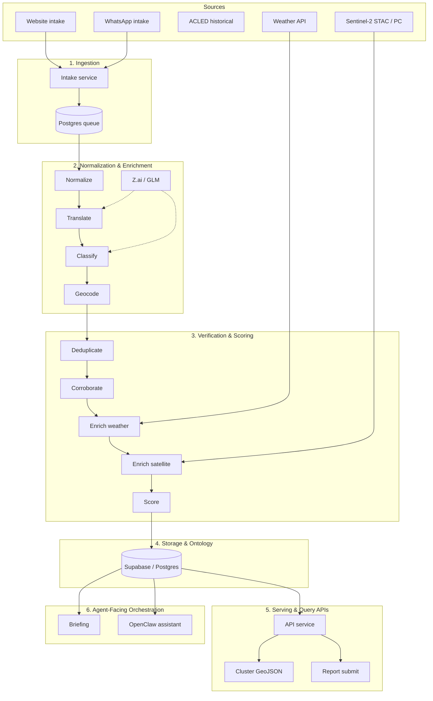
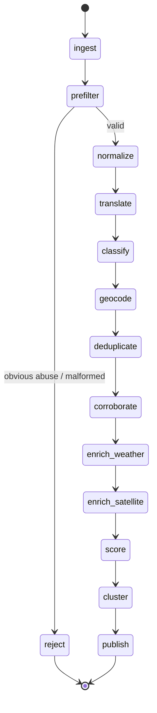

# Post–Stage 2 Platform Completion Plan

> **Purpose:** Complete the humanitarian intelligence platform to match the architectural backbone. This document is the single source of truth for system shape, artifacts, and remaining work.

**Goal:** Treat the system as a historical-demo backend for a future live system: deterministic pipeline backbone, agentic components only for translation/extraction/classification/summarization, six clear layers, and a concrete artifact set (architecture, service spec, schema, LangGraph, API, confidence design).

**Architecture:** Supabase = application database; LangGraph = orchestration of pipeline state and controlled nodes; Z.ai/GLM = translation, extraction, classification, summarization; OpenClaw = operator-facing assistant on top; FLock = optional extension. No freeform agent swarm; no building-level satellite claims; conservative rejection only for high-confidence abuse.

**Tech Stack:** (unchanged) Python 3.12, FastAPI, LangGraph, Supabase/PostGIS, React 18 + Vite, Mapbox GL JS, Supabase Realtime, pytest, Vitest.

---

## 1. Backbone Principles (Condensed)

| Principle | Implication |
|-----------|-------------|
| **Historical-demo, not live crisis product** | ACLED as baseline event layer + simulation prior; dummy user reports through same pipeline as real. |
| **10 m / 5-day satellite = corroboration only** | Coarse change, route/settlement risk, infrastructure-damage hypothesis. No “this building was hit” verification. |
| **Deterministic pipeline backbone** | LangGraph as workflow with predetermined path; agentic only for classification, normalization, translation, summarization, confidence synthesis. |
| **Six layers** | Ingestion → Normalization & enrichment → Verification & scoring → Storage & ontology → Serving & query APIs → Agent-facing orchestration. |
| **Confidence, not truth labels** | Decomposed interpretable signals; publishability, urgency, access-difficulty as separate axes. Auto-reject only for obvious abuse/gibberish/mass spam; else downgrade, never silent discard. |
| **Clusters as map primitive** | Operator sees incident clusters (severity, confidence, needs, infrastructure hazards), not raw reports. |
| **Clean tech division** | Supabase = DB/auth/realtime; LangGraph = orchestration; Z.ai = soft NLP; OpenClaw = assistant UI; FLock = optional later. |

---

## 2. Current State After Stage 1 + Stage 2

| Layer | Stage 1 | Stage 2 |
|-------|---------|---------|
| **Ingestion** | Report API, queue (Postgres SKIP LOCKED), ACLED adapter, seed generator | Stream simulator posting to `POST /api/reports`; worker loop |
| **Normalization & enrichment** | Normalize, translate (stub), classify (stub), geocode; weather + satellite STAC | Planetary Computer + indices (NDVI/NDWI/MNDWI), SCL quality, flood/change scores |
| **Verification & scoring** | 9-signal confidence, score node, conservative reject | Satellite fusion (watch/detect/deliver), confidence breakdown includes satellite corroboration |
| **Storage & ontology** | Migrations 001–010; taxonomy, reports, locations, clusters, queue, RLS | Migration 011 (satellite EO cache/analytics/ML jobs) |
| **Serving & query APIs** | `POST /api/reports`, `GET /api/clusters` (GeoJSON), health | `POST /api/assistant/query`; streaming/simulation/worker status APIs |
| **Agent-facing orchestration** | Briefing service (deterministic) | OpenClaw assistant (deterministic + optional FLock enhancement) |

**Not yet done (from backbone):** WhatsApp structured intake; Z.ai wired into pipeline nodes (translation, extraction, classification); formal artifact set (diagrams, service spec, API contract doc); analyst-review modifier (optional).

---

## 3. Artifact Set

The following subsections are the **concrete artifacts** that complete the design on paper and guide implementation.

### 3.1 System Architecture Diagram

### 3.2 Service-by-Service Specification

| Service | Responsibility | In codebase | Notes |
|---------|----------------|------------|-------|
| **Intake** | Website + WhatsApp structured intake; attachment handling; rate limit; anti-spam precheck | `api/reports.py`, RPC `create_report_with_job` | WhatsApp path not implemented; same pipeline for all sources. |
| **Normalization** | Language detection, translation, schema extraction, category tagging, geocoding | `pipeline/graph`: normalize, translate, classify, geocode | Z.ai not wired; nodes are stubs or deterministic. |
| **Verification** | Duplicate detection, cross-source match, ACLED context, weather/satellite enrichment, confidence scoring | `pipeline/graph`: deduplicate, corroborate, enrich_weather, enrich_satellite, score; `services/satellite_fusion` | Implemented; analyst modifier optional. |
| **Clustering** | Spatiotemporal grouping, incident cluster updates, severity synthesis, infrastructure overlay | Pipeline cluster node; DB `incident_clusters`; RPC `get_incident_clusters_geojson` | Implemented. |
| **Briefing** | NGO summary, evidence narratives, multilingual output | `services/briefing.py` | Deterministic template. |
| **API** | Cluster queries, report submission, audit fetch, map endpoints, streaming/worker/simulation status | `api/reports`, `api/clusters`, `api/assistant`, Stage 2 streaming/worker/simulation | Implemented. |
| **Orchestrator** | LangGraph workflow, job retries, state persistence, traceability | `pipeline/graph.py`, `pipeline/state.py`, queue + worker | Implemented. |

### 3.3 Database Schema Summary

| Entity | Purpose |
|--------|---------|
| `locations` | PostGIS point; country, admin, precision. |
| `reports` | source_type, mode (creation/enrichment), anonymity, timestamp, narrative, crisis_categories, help_categories, parent_report_id, extracted_facts, processing_metadata. |
| `report_media` | Attachments; FK reports. |
| `translations` | source/target language, model, confidence. |
| `source_evidence` | Links reports to ACLED/satellite/weather. |
| `taxonomy_terms` | Typed ontology; hierarchy via parent_id. |
| `infrastructure_objects` | PostGIS; type, status, source. |
| `damage_assessments` | Per-infrastructure; damage_level, confidence. |
| `weather_snapshots` | Per-location; risks (flood, heat, storm, route). |
| `satellite_observations` | scene_id, cloud_cover, change_detected, change_type. |
| `satellite_scene_cache` / `satellite_analytics` (Stage 2) | EO cache; NDVI/NDWI/MNDWI; flood/change/quality. |
| `incident_clusters` | centroid, radius_km, report_count, weighted_severity, weighted_confidence, top_need_categories, access_blockers, infrastructure_hazards, evidence_summary. |
| `verification_runs` | Pipeline audit: version, node_trace, timing, status. |
| `confidence_scores` | report_id, verification_run_id; publishability, urgency, access_difficulty; breakdown JSONB. |
| `pipeline_jobs` | report_id, status, priority, attempts, claim_next_job. |

*First-class report modes:* `incident_creation` | `incident_enrichment`. No `aid_requests` table in current schema; can be added later if needed.

### 3.4 LangGraph State Diagram

**Branching rules:** (1) prefilter → reject only for empty/gibberish (&lt;10 chars) or malformed; (2) anonymous → lower source prior in score; (3) low confidence → retain, do not elevate; (4) highly corroborated → publish to cluster. Single conditional edge (prefilter); rest linear.

### 3.5 API Contract Summary

| Method | Path | Purpose |
|--------|------|---------|
| GET | `/health` | Liveness. |
| POST | `/api/reports` | Submit report; body: latitude, longitude, narrative (min 10), language, crisis_categories, help_categories, anonymous, parent_report_id?; returns report_id, status. |
| GET | `/api/clusters` | GeoJSON FeatureCollection; query: bbox?, min_severity?, country_iso?, limit?. |
| POST | `/api/assistant/query` | Prompt + optional cluster_id; returns AssistantResponse (blocks: text, bullets, citation, warning); 503 if OpenClaw disabled. |
| GET | `/api/streaming/stats` | Queue depth, ingress/processing rate, lag (Stage 2). |
| GET | `/api/streaming/health` | ok | degraded | backpressured (Stage 2). |
| POST | `/api/simulation/start` \| `stop` | Control fake-data stream (Stage 2). |
| GET | `/api/simulation/status` | Stream status (Stage 2). |
| POST | `/api/worker/start` \| `stop` | Worker control (Stage 2). |
| GET | `/api/worker/status` | Worker status (Stage 2). |
| GET | `/api/realtime/health` | Realtime readiness (Stage 2). |

### 3.6 Confidence Scoring Design

**Nine signals (0–1):**

| Signal | Meaning | Direction |
|--------|---------|-----------|
| source_prior | Trust floor by source type | ↑ = more trusted |
| spam_score | Abuse probability | ↑ = more spam |
| duplication_score | Near-duplicate overlap | ↑ = more duplicated |
| completeness_score | Ontology coverage | ↑ = more complete |
| geospatial_consistency | Location plausibility | ↑ = more consistent |
| temporal_consistency | Timestamp plausibility | ↑ = more consistent |
| cross_source_corroboration | Independent confirmation | ↑ = more confirmed |
| weather_plausibility | Weather context alignment | ↑ = more plausible |
| satellite_corroboration | Satellite evidence support | ↑ = more supported |

**Source priors (examples):** acled_historical 0.95; weather 0.95; satellite 0.85; web_identified 0.80; whatsapp_identified 0.65; web_anonymous 0.55; whatsapp_anonymous 0.40.

**Outputs (independent axes):**

- **Publishability** — weighted combination of all nine; spam weighted ~20% (inverted); if duplication_score &gt; 0.8 then halve. Bounded [0, 1].
- **Urgency** — time-sensitivity of need (separate from publishability).
- **Access difficulty** — weather + route + conflict; feeds NGO logistics.

**Rejection policy:** Auto-reject only for prefilter (empty/gibberish/malformed) or future high-confidence abuse (mass spam, banned-content). All other low-confidence cases → retain with low publishability; never silent discard.

---

## 4. Implementation Roadmap (Post–Stage 2)

Phased work to align with the backbone without micro-task sprawl.

### Phase A: Artifacts and documentation (no code dependency)

- [ ] **A.1** Persist this document as the canonical architecture reference; ensure `AGENTS.md` and any onboarding docs point to it.
- [ ] **A.2** Export the Mermaid diagrams to a shared location (e.g. `docs/architecture/`) or render in CI/wiki if desired.
- [ ] **A.3** Add a one-page “system shape” summary (backbone principles + six layers + tech division) to the repo root or `docs/`.

### Phase B: Z.ai in the pipeline (optional but backbone-aligned)

- [ ] **B.1** Wire Z.ai provider into **translate** node: when language ≠ en and Z.ai enabled, call provider; else keep stub/identity.
- [ ] **B.2** Wire Z.ai into **classify** node: optional extraction of crisis_categories / help_categories from narrative; fallback to current stub.
- [ ] **B.3** Keep scoring and publishing logic deterministic; no LLM in prefilter, deduplicate, corroborate, score, cluster.

### Phase C: WhatsApp intake path

- [ ] **C.1** Define WhatsApp intake contract (payload shape: narrative, location, categories, optional media); same normalizer → pipeline as web.
- [ ] **C.2** Implement adapter: map WhatsApp payload to `ReportSubmission`-equivalent; enqueue via same `create_report_with_job` or dedicated RPC.
- [ ] **C.3** Add `POST /api/intake/whatsapp` or equivalent; rate limit and anti-spam precheck as for web. No Twilio/Meta gateway required for demo; can stub or use test webhook.

### Phase D: Polish and deferrals

- [ ] **D.1** Analyst-review modifier: optional 10th signal or override in `confidence_scores`; default 0 (no review). Document in confidence design.
- [ ] **D.2** Auth + roles: defer until operator workflows stabilize (per backbone).
- [ ] **D.3** Full Mapbox UI + Realtime: complete Stage 2 Tasks 10–13 if not already done; then treat as done for this completion plan.

**Explicitly out of scope for this completion:**

- Freeform multi-agent swarm.
- Building-level or fine-grained satellite verification.
- Decentralized compute (FLock remains optional enhancement only).
- Live scraping of uncontrolled web sources.
- Automatic hard deletions based on vague “false report” logic.

---

## 5. Success Criteria for “Complete”

- All artifact set sections (3.1–3.6) are the single source of truth and match the running system.
- Pipeline is deterministic except where LLMs are explicitly used (translate/classify); rejection is conservative.
- Clusters are the map primitive; report submission and cluster GeoJSON are production paths.
- Optional: Z.ai used in translate/classify when enabled; WhatsApp intake path available; analyst modifier documented.
- No scope creep: no agent swarm, no building-level satellite claims, no FLock on critical path.

---

## 6. References

- Stage 1 plan: `docs/plans/2026-03-07-humanitarian-intelligence-platform.md`
- Stage 2 plan: `docs/plans/2026-03-07-humanitarian-intelligence-platform-stage-2.md`
- Backbone prompt: user-provided “Claude prompt” (historical-demo, six layers, deterministic pipeline, confidence not truth, clusters as map primitive, clean tech division).
